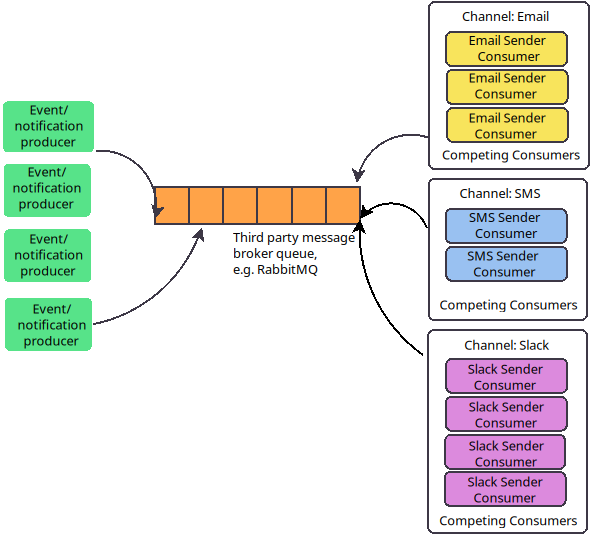

# msg-system
# MSG Notifications System

## Goals
* The system is able to send notifications via several 
different channels (email, sms, slack) and others.
* The system is horizontally scalable.
* The system guarantees "exactly once" SLA for sending the message.

## Components

### Notification producers
These are the agents that produce notifications.

### Message/Notification Queue
Since we aim to send the notification exactly once, it makes sense
to use a message queue for the purpose.
The message broker of choice in this implementation is Rabbit MQ, as it also 
suggests awareness of the producer to the consumption of the notification.

### Channel Consumers
The channel consumers receive notifications and send them in their 
specific channel, which at the moment is Email, SMS and Slack, but could be 
extended to any other channel.

Every channel has its own pool of instances of the consumers, that compete 
for the next notification for their channel. They could be scaled horizontally
with load-orchestration agent, such as Kubernetes.

### Simulation
End-to-end simulation of the system for experimental purposes.
Alternatively, Spring Boot + RabbitMQ could have been used.

#### Prerequisites
* Java 11+
* Maven 3.8+
* RabbitMQ running (see https://www.rabbitmq.com/client-libraries/java-api-guide#getting)